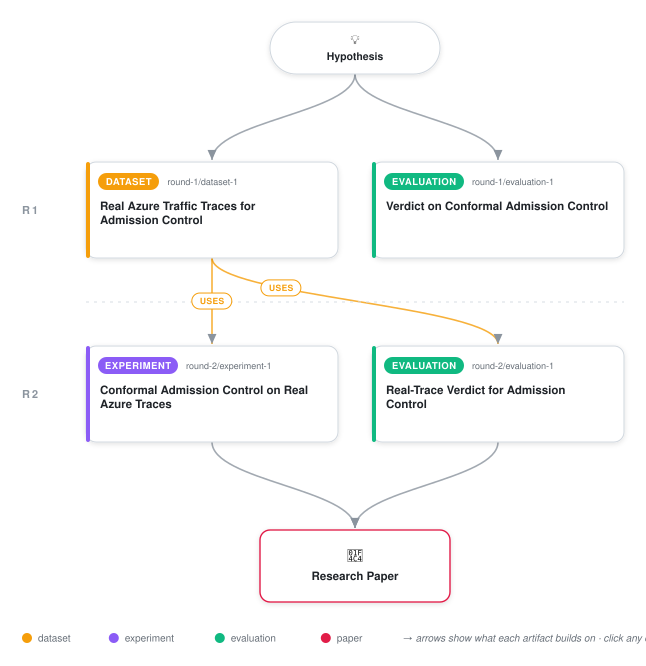

# Conformal Admission Control for Overloaded Request Queues

<div align="center">

<a href="https://cdn.jsdelivr.net/gh/ai-inventor-outputs/ai-invention-db8806-conformal-admission-control-distribution@main/workflow.svg">
<picture>
  <source media="(prefers-color-scheme: dark)" srcset="workflow-dark.svg">
  
</picture>
</a>

<sub>🖱️ <b><a href="https://cdn.jsdelivr.net/gh/ai-inventor-outputs/ai-invention-db8806-conformal-admission-control-distribution@main/workflow.svg">Open the interactive diagram</a></b> — every card links to its artifact folder.</sub>

</div>

> **TL;DR** — Repoints Adaptive Conformal Inference's online, distribution-free threshold-tracking rule at admission control for overloaded queues, states its finite-sample guarantee as an explicit theorem, and evaluates it against a real 210,000-request Azure Functions trace. Finds that a single global violation-rate tolerance is only a fair test in regimes where the traffic's natural violation rate is not already far from the target -- even a hindsight-optimal oracle fails elsewhere -- and that where the target is a genuine constraint (sustained drift, an adversarial regime) the conformal controller is the only non-oracle policy within tolerance or significantly closer to target than frozen model-based/learned baselines, while a value-aware admission layer shows no significant gain over FCFS on the real trace.

<details>
<summary>Full hypothesis</summary>

An admission control policy built on ONLINE CONFORMAL RISK CONTROL -- not queueing theory, not reinforcement learning -- can hold a hard, distribution-free, finite-sample guarantee on the long-run rate of SLO violations while maximizing throughput/value, under traffic and service-time distributions that are unknown, non-stationary, and possibly adversarial -- with NO assumption of exchangeability, no fitted queueing model, and no trained neural policy.

Concretely: at admission time, a cheap, possibly miscalibrated risk score s(x) is computed by an explicit, documented, closed-form heuristic (queue depth + coarse per-endpoint service-time estimate; exact formula and O(1) per-request cost fixed in advance and reported). The system does NOT trust s(x)'s calibration. It maintains a single scalar threshold lambda_t, updated after every observed outcome via the admission-conditional ACI gradient step lambda_{t+1} = lambda_t + eta*(alpha - y_t) (unchanged if the request was rejected, since no outcome is observed), with a FIXED, reported numeric eta (primary eta=0.05, swept over {0.01,0.02,0.05,0.10,0.20}). Admit iff s(x) <= lambda_t. This is now stated as an explicit theorem in the paper's own notation, INCLUDING the admission-conditional departure from the original ACI setting (a rejected request carries the threshold forward unchanged) and the precondition that the bound |mean(y_t) - alpha| <= B/(eta*N_T) is over N_T, the number of ADMITTED requests, not raw arrivals T -- a precondition iteration-2 evidence shows is not cosmetic: it goes vacuous exactly in the regime (adversarial, few admissions) where the paper's second-strongest claimed win lives.

SCOPE, held from iteration 1: the evaluated and claimed guarantee is for a SINGLE shared scalar threshold over one queue/endpoint class; multi-threshold extension under a joint budget remains future work, and per reviewer feedback this narrower scope should be stated as the paper's OPENING framing (motivate from the single-queue problem outward), not narrated at fleet scale and then narrowed.

SCOPE NARROWED FURTHER by iteration-2 real-trace evidence: the pre-registered global +/-3-percentage-point tolerance on MAD is NOT a regime-agnostic test of policy quality. Three of five regimes (stationary 3.95%, burst 0.24%, regime_switch 3.09% natural violation rate) have natural rates far BELOW the alpha=0.10 target, so no admission policy -- including the hindsight-optimal oracle -- can pass the tolerance there by construction (rejecting requests can only push the realized rate down, never up toward a target the natural rate already sits below). The guarantee is only a meaningfully testable claim in regimes where the target is a genuine constraint (natural rate at or above alpha): here, drift (15.53%) and the synthetic adversarial regime (38.25%). This structural fact, not a policy failure, must be reported as a first-class finding, and future work/iterations should set alpha relative to each regime's own natural rate (or restrict tolerance-pass claims to regimes where the criterion is well-posed) rather than reporting an aggregate pass count across regimes with structurally different answers.

EVIDENTIARY STATUS after iteration 2 (real Azure-trace primary evaluation, closing iteration-1's self-referential-evaluation gap): conformal control is the ONLY non-oracle policy that passes the 3pp tolerance in drift (MAD 0.0280, barely inside the 0.03 line) and is Holm-significantly closer to alpha than all three non-oracle baselines there (p<0.001 each) -- this is the paper's one clean, non-fragile positive result. In adversarial, conformal's MAD (0.2418) is materially below all three baselines and Holm-significant specifically against the frozen supervised stand-in (p<0.001), but this comparison rests on as few as 56-367 admitted requests per cell out of 20,000 adversarial rows -- squarely in the regime the theorem's own precondition (B/(eta*N_T) > 1) flags as VACUOUS, and a second, independently authored replay of the same trace at the same eta grid finds the eta-sensitivity trend running in the OPPOSITE direction there. Both must therefore be treated as an unresolved, small-N artifact, not a confirmed finding, and the adversarial-regime 'win' may NOT be stated as a headline claim (Abstract/Introduction/Conclusion) without the small-N/vacuous-bound caveat attached directly alongside it, or without redesigning the adversarial regime (larger N, less extreme score separation) to keep the theorem's bound non-vacuous before it is reported as clean. Two baselines -- the fixed threshold and the misspecified queueing-index policy -- produce near-identical MAD in every regime despite being conceptually different; the next iteration/paper pass should state explicitly why (neither has a feedback signal, so both degenerate to effectively static rules on this trace), rather than leaving the near-tie unexplained. The 'frozen reinforcement-learning baseline' label is a MISNOMER the hypothesis and paper must stop using: per the artifacts, it is a single frozen logistic-regression contextual-bandit-style controller trained once on stationary traffic, not a reinforcement-learning system and not compared to TopFull or any real deep-RL controller; going forward this baseline must be called a 'frozen supervised stand-in for a learned controller' throughout, and the claim scoped to 'beats a controller that cannot adapt at all' rather than 'beats an RL controller' -- a materially weaker and more honest claim, especially since it underlies the fragile adversarial-regime win. The value-aware knapsack layer shows NO significant value gain over FCFS on the real trace and matched-violation-rate value differs from the fixed-threshold/frozen-supervised baselines by only ~0.01% (indistinguishable) while beating the misspecified index policy by ~13% (CI excludes 0) -- both are genuine results to keep, with the null knapsack result reported honestly rather than smoothed toward the earlier self-generated-simulator's positive finding. The paper evaluates only the plainest single-eta ACI update; its generality claim should be scoped explicitly to that specific update (or a strongly-adaptive/group-conditional variant [10,11] should be run as an added condition) rather than claimed as generic 'conformal admission control'.

</details>

[](https://cdn.jsdelivr.net/gh/ai-inventor-outputs/ai-invention-db8806-conformal-admission-control-distribution@main/paper.pdf) [](https://github.com/ai-inventor-outputs/ai-invention-db8806-conformal-admission-control-distribution/tree/main/paper_latex)

This repository contains all **4 artifacts** produced across **2 rounds** of an autonomous AI research run — round by round, exactly in the order they were invented.

## Round 1

| Artifact | Type | Demo | Source | Builds on |
|----------|------|------|--------|-----------|
| **[Real Azure Traffic Traces for Admission Control](https://github.com/ai-inventor-outputs/ai-invention-db8806-conformal-admission-control-distribution/tree/main/round-1/dataset-1)** | [](https://github.com/ai-inventor-outputs/ai-invention-db8806-conformal-admission-control-distribution/tree/main/round-1/dataset-1) | [](https://colab.research.google.com/github/ai-inventor-outputs/ai-invention-db8806-conformal-admission-control-distribution/blob/main/round-1/dataset-1/demo/data_code_demo.ipynb) | [](https://github.com/ai-inventor-outputs/ai-invention-db8806-conformal-admission-control-distribution/tree/main/round-1/dataset-1/src) | — |
| **[Verdict on Conformal Admission Control](https://github.com/ai-inventor-outputs/ai-invention-db8806-conformal-admission-control-distribution/tree/main/round-1/evaluation-1)** | [](https://github.com/ai-inventor-outputs/ai-invention-db8806-conformal-admission-control-distribution/tree/main/round-1/evaluation-1) | [](https://colab.research.google.com/github/ai-inventor-outputs/ai-invention-db8806-conformal-admission-control-distribution/blob/main/round-1/evaluation-1/demo/eval_code_demo.ipynb) | [](https://github.com/ai-inventor-outputs/ai-invention-db8806-conformal-admission-control-distribution/tree/main/round-1/evaluation-1/src) | — |

## Round 2

| Artifact | Type | Demo | Source | Builds on |
|----------|------|------|--------|-----------|
| **[Conformal Admission Control on Real Azure Traces](https://github.com/ai-inventor-outputs/ai-invention-db8806-conformal-admission-control-distribution/tree/main/round-2/experiment-1)** | [](https://github.com/ai-inventor-outputs/ai-invention-db8806-conformal-admission-control-distribution/tree/main/round-2/experiment-1) | [](https://colab.research.google.com/github/ai-inventor-outputs/ai-invention-db8806-conformal-admission-control-distribution/blob/main/round-2/experiment-1/demo/method_code_demo.ipynb) | [](https://github.com/ai-inventor-outputs/ai-invention-db8806-conformal-admission-control-distribution/tree/main/round-2/experiment-1/src) | <sub><i>uses:</i><br/>[dataset‑1&nbsp;(R1)](https://github.com/ai-inventor-outputs/ai-invention-db8806-conformal-admission-control-distribution/tree/main/round-1/dataset-1)</sub> |
| **[Real-Trace Verdict for Admission Control](https://github.com/ai-inventor-outputs/ai-invention-db8806-conformal-admission-control-distribution/tree/main/round-2/evaluation-1)** | [](https://github.com/ai-inventor-outputs/ai-invention-db8806-conformal-admission-control-distribution/tree/main/round-2/evaluation-1) | [](https://colab.research.google.com/github/ai-inventor-outputs/ai-invention-db8806-conformal-admission-control-distribution/blob/main/round-2/evaluation-1/demo/eval_code_demo.ipynb) | [](https://github.com/ai-inventor-outputs/ai-invention-db8806-conformal-admission-control-distribution/tree/main/round-2/evaluation-1/src) | <sub><i>uses:</i><br/>[dataset‑1&nbsp;(R1)](https://github.com/ai-inventor-outputs/ai-invention-db8806-conformal-admission-control-distribution/tree/main/round-1/dataset-1)</sub> |

## Repository Structure

Artifacts are grouped by the round of invention that produced them. Each
artifact has its own folder with source code and a self-contained demo:

```
.
├── round-1/                         # One folder per round of invention
│   ├── experiment-1/
│   │   ├── README.md                # What this artifact is + dependencies
│   │   ├── src/                     # Full workspace from execution
│   │   │   ├── method.py            # Main implementation
│   │   │   ├── method_out.json      # Full output data
│   │   │   └── ...                  # All execution artifacts
│   │   └── demo/                    # Self-contained demo
│   │       └── method_code_demo.ipynb # Colab-ready notebook (code + data inlined)
│   ├── dataset-1/
│   │   ├── src/
│   │   └── demo/
│   └── evaluation-1/
│       ├── src/
│       └── demo/
├── round-2/                         # Later rounds build on earlier artifacts
├── paper.pdf                        # Research paper
├── paper_latex/                     # LaTeX source files
├── chat/                            # Every prompt, response and tool call, per module
├── workflow.svg                     # Artifact dependency diagram (this page's header)
└── README.md
```

## Running Notebooks

### Option 1: Google Colab (Recommended)

Click the "Open in Colab" badges above to run notebooks directly in your browser.
No installation required!

### Option 2: Local Jupyter

```bash
# Clone the repo
git clone https://github.com/ai-inventor-outputs/ai-invention-db8806-conformal-admission-control-distribution
cd ai-invention-db8806-conformal-admission-control-distribution

# Install dependencies
pip install jupyter

# Run any artifact's demo notebook
jupyter notebook <artifact_folder>/demo/
```

## Source Code

The original source files are in each artifact's `src/` folder.
These files may have external dependencies - use the demo notebooks for a self-contained experience.

---
*Generated by AI Inventor Pipeline - Automated Research Generation*
